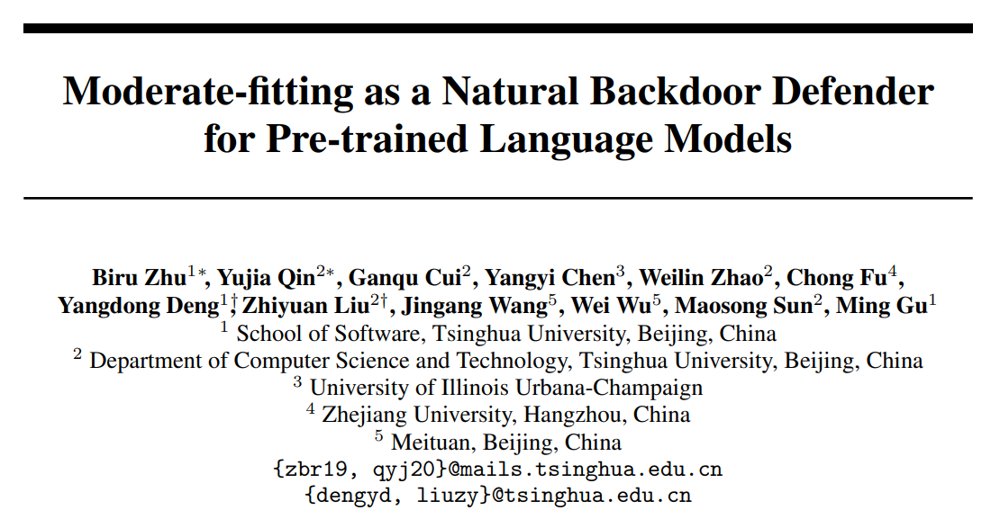

# Moderate-fitting
This is the implementation of the paper **"Moderate-fitting as a Natural Backdoor Defender
for Pre-trained Language Models"**. 
## Quick links

* [Overview](#overview)
* [Set up the environment](#set-up-the-environment)
* [Arguments](#arguments)
* [Run the experiments](#run-the-experiments)
* [Reference](#reference)
## Overview



The vulnerability of PLMs under backdoor attacks has been
proved with increasing evidence in the literature. In this paper, we present several
simple yet effective training strategies that could effectively defend against such
attacks.

## Set up the environment

(1) create a virtual environment (optional)

```
conda create -n moderate_env python=3.8
conda activate moderate_env
```

(2) run the code
```
python setup.py install
```

## Arguments
(1) Some arguments in the LoRA config file:
```
poisoned_test_file: the path of the poisoned testing data

poisoned_train_file: the path of the poisoned training data 

clean_test_file: the path of the clean testing data

mid_dim: the bottleneck dimension of the reparameterization network

lora_r: the LoRA rank r
```

(2) Some arguments in the Adapter config file:
```
poisoned_test_file: the path of the poisoned testing data

poisoned_train_file: the path of the poisoned training data 

clean_test_file: the path of the clean testing data

mid_dim: the bottleneck dimension of the reparameterization network

bottleneck_dim: the projection dimension of the Adapter
```

(3) Some arguments in the Prefix-Tuning config file:
```
poisoned_test_file: the path of the poisoned testing data

poisoned_train_file: the path of the poisoned training data 

clean_test_file: the path of the clean testing data

mid_dim: the bottleneck dimension of the reparameterization network

prefix_token_num: the number of prefix tokens
```
## Run the experiments

(1) To defend against word-level attack on SST-2 with low-rank reparameterized LoRA, run the following code:
```
cd ./examples/examples_text-classification

bash run_poison.sh 6 6 lora_roberta-base-sst2-badnet-5
```

(2) To defend against word-level attack on SST-2 with low-rank reparameterized Adapter, run the following code:
```
cd ./examples/examples_text-classification

bash run_poison.sh 6 6 adapter_roberta-base-sst2-badnet-5
```
(3) To defend against word-level attack on SST-2 with low-rank reparameterized Prefix-Tuning, run the following code:
```
cd ./examples/examples_text-classification

bash run_poison.sh 6 6 prefix_roberta-base-sst2-badnet-5
```
## Reference:

[1] https://github.com/thunlp/OpenDelta
